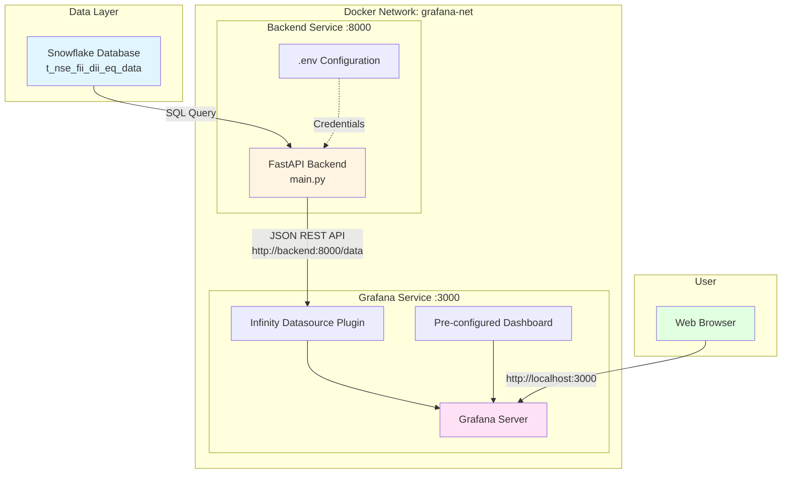
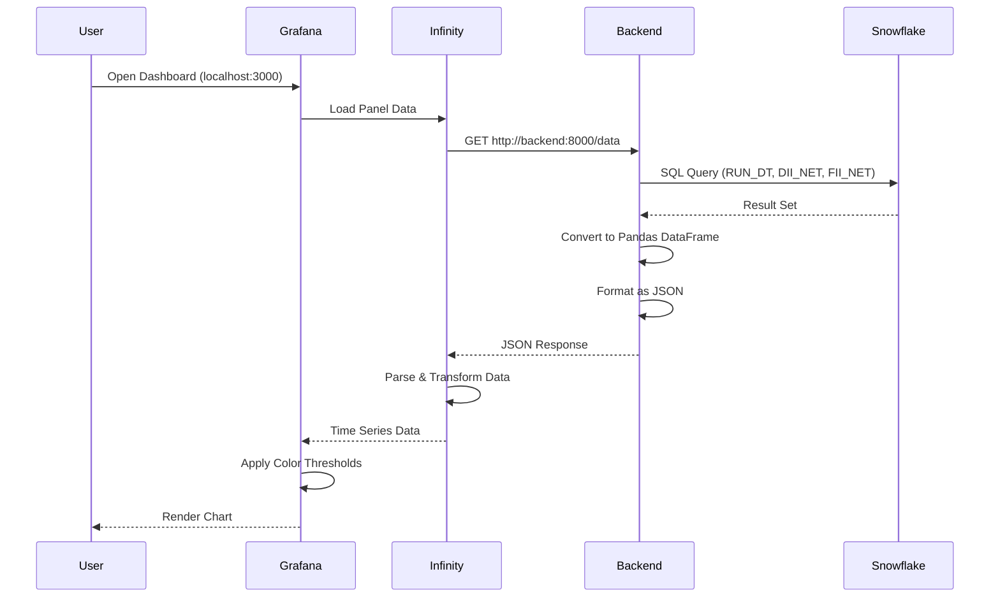

# NFD Visualizations - System Architecture

## Overview

This project visualizes NSE FII/DII (Foreign Institutional Investors / Domestic Institutional Investors) equity data from Snowflake using Grafana dashboards. The system follows a three-tier architecture with data storage, API backend, and visualization layers.

## Architecture Diagram



## Component Details

### 1. Data Layer: Snowflake Database

**Purpose**: Stores historical NSE FII/DII equity trading data

**Table**: `t_nse_fii_dii_eq_data`

**Key Columns**:
- `RUN_DT` - Trading date
- `DII_NET` - Domestic Institutional Investors net buy/sell (₹ Crores)
- `FII_NET` - Foreign Institutional Investors net buy/sell (₹ Crores)

**Data Semantics**:
- Positive values = Net buying
- Negative values = Net selling

---

### 2. Backend Service: FastAPI

**Location**: [`backend/main.py`](file:///c:/Users/Srikanth%20Tirandas/Documents/LD/Projects/nfd_visualizations/backend/main.py)

**Technology Stack**:
- FastAPI (Python web framework)
- Snowflake Connector for Python
- Pandas for data transformation
- Uvicorn ASGI server

**Endpoints**:

#### `GET /data`
- **Purpose**: Fetch FII/DII data from Snowflake
- **Query**: `SELECT RUN_DT, DII_NET, FII_NET FROM t_nse_fii_dii_eq_data ORDER BY RUN_DT ASC`
- **Response**: JSON array of records
- **Example**:
  ```json
  [
    {
      "RUN_DT": "2025-01-15",
      "DII_NET": 1234.56,
      "FII_NET": -789.12
    }
  ]
  ```

#### `GET /health`
- **Purpose**: Health check endpoint
- **Response**: `{"status": "ok"}`

**Configuration**: Reads Snowflake credentials from environment variables via `.env` file:
- `SNOWFLAKE_ACCOUNT`
- `SNOWFLAKE_USER`
- `SNOWFLAKE_PASSWORD`
- `SNOWFLAKE_ROLE`
- `SNOWFLAKE_WAREHOUSE`
- `SNOWFLAKE_DATABASE`
- `SNOWFLAKE_SCHEMA`

**CORS**: Enabled for all origins to allow Grafana access

**Container Details**:
- **Port**: 8000
- **Network**: `grafana-net`
- **Hostname**: `backend` (used by Grafana to call the API)

---

### 3. Visualization Layer: Grafana

**Technology**: Grafana OSS (Open Source)

**Port**: 3000 (accessible at `http://localhost:3000`)

#### Key Features

**Anonymous Access**: Enabled with Admin role for easy access without login
```yaml
GF_AUTH_ANONYMOUS_ENABLED=true
GF_AUTH_ANONYMOUS_ORG_ROLE=Admin
```

**Infinity Datasource Plugin**: Allows Grafana to fetch data from REST APIs (not just traditional databases)
```yaml
GF_INSTALL_PLUGINS=yesoreyeram-infinity-datasource
```

#### Provisioning (Auto-Configuration)

Grafana is pre-configured using provisioning files mounted from [`grafana/provisioning`](file:///c:/Users/Srikanth%20Tirandas/Documents/LD/Projects/nfd_visualizations/grafana/provisioning):

##### Datasource Configuration
**File**: [`datasources/datasource.yml`](file:///c:/Users/Srikanth%20Tirandas/Documents/LD/Projects/nfd_visualizations/grafana/provisioning/datasources/datasource.yml)

- **Name**: `Snowflake-Infinity`
- **Type**: `yesoreyeram-infinity-datasource`
- **Access Mode**: Proxy (Grafana server makes the API calls)
- **Default**: Set as the default datasource

##### Dashboard Configuration
**File**: [`dashboards/dashboard.json`](file:///c:/Users/Srikanth%20Tirandas/Documents/LD/Projects/nfd_visualizations/grafana/provisioning/dashboards/dashboard.json)

**Dashboard Name**: NSE FII/DII Dashboard

**Panel Configuration**:
- **Type**: Time series chart
- **Title**: "DII/FII Net Buy/Sell Trend"
- **X-axis**: Trading Day (RUN_DT)
- **Y-axis**: ₹ Crores
- **Data Source**: Calls `http://backend:8000/data`
- **Color Coding**:
  - Red: Negative values (net selling)
  - Green: Positive values (net buying)
- **Features**:
  - Centered zero axis
  - Line chart with fill
  - Auto-refresh capability
  - Default time range: Last 30 days

---

## Data Flow



## Why Grafana?

### Advantages of This Architecture

1. **No Direct Database Access**: Grafana doesn't need Snowflake credentials
   - Backend handles authentication securely
   - Easier to manage access control

2. **API Abstraction Layer**: 
   - Backend can implement business logic, caching, or data transformation
   - Can switch data sources without changing Grafana configuration

3. **Infinity Datasource Flexibility**:
   - Can consume any REST API
   - Not limited to traditional database datasources

4. **Pre-configured Dashboards**:
   - Dashboard is version-controlled as code
   - Automatic deployment via provisioning
   - No manual configuration needed

5. **Professional Visualization**:
   - Time series analysis
   - Interactive charts
   - Color-coded thresholds
   - Responsive design

6. **Containerized Deployment**:
   - Consistent environment
   - Easy to deploy and scale
   - Network isolation

## Deployment

### Using Docker Compose (Recommended)

```bash
docker-compose up -d --build
```

This single command:
- Builds the FastAPI backend container
- Pulls the Grafana image
- Creates a shared network
- Starts both services
- Provisions datasources and dashboards automatically

**Access**: Open `http://localhost:3000` in your browser

### Alternative: Running Components Separately

#### Backend Only
```bash
pip install -r backend/requirements.txt
python backend/main.py
```
- Runs on `http://127.0.0.1:8000`
- Requires local Python environment
- Still need to run Grafana separately

#### Grafana Only
```bash
docker run -d -p 3000:3000 \
  -v ./grafana/provisioning:/etc/grafana/provisioning \
  -e GF_INSTALL_PLUGINS=yesoreyeram-infinity-datasource \
  grafana/grafana:latest
```

> [!WARNING]
> When running separately, update the datasource URL from `http://backend:8000/data` to `http://host.docker.internal:8000/data` (or `http://localhost:8000/data` if Grafana is not in Docker)

## Network Architecture

### Docker Network: `grafana-net`

Both services are on the same Docker network, enabling:
- **Service Discovery**: Grafana can reach backend via hostname `backend`
- **Internal Communication**: No need to expose backend to host machine
- **Security**: Backend is not accessible from outside Docker network (unless port is exposed)

### Port Mapping

| Service | Internal Port | External Port | Purpose |
|---------|---------------|---------------|---------|
| Backend | 8000 | 8000 | FastAPI REST API |
| Grafana | 3000 | 3000 | Web UI |

## Configuration Files

| File | Purpose |
|------|---------|
| [`docker-compose.yml`](file:///c:/Users/Srikanth%20Tirandas/Documents/LD/Projects/nfd_visualizations/docker-compose.yml) | Orchestrates both services |
| [`backend/Dockerfile`](file:///c:/Users/Srikanth%20Tirandas/Documents/LD/Projects/nfd_visualizations/backend/Dockerfile) | Backend container definition |
| [`backend/requirements.txt`](file:///c:/Users/Srikanth%20Tirandas/Documents/LD/Projects/nfd_visualizations/backend/requirements.txt) | Python dependencies |
| [`.env`](file:///c:/Users/Srikanth%20Tirandas/Documents/LD/Projects/nfd_visualizations/.env) | Snowflake credentials (gitignored) |
| [`grafana/provisioning/datasources/datasource.yml`](file:///c:/Users/Srikanth%20Tirandas/Documents/LD/Projects/nfd_visualizations/grafana/provisioning/datasources/datasource.yml) | Auto-configure Infinity datasource |
| [`grafana/provisioning/dashboards/dashboard.yml`](file:///c:/Users/Srikanth%20Tirandas/Documents/LD/Projects/nfd_visualizations/grafana/provisioning/dashboards/dashboard.yml) | Dashboard provider config |
| [`grafana/provisioning/dashboards/dashboard.json`](file:///c:/Users/Srikanth%20Tirandas/Documents/LD/Projects/nfd_visualizations/grafana/provisioning/dashboards/dashboard.json) | Dashboard definition |

## Security Considerations

1. **Environment Variables**: Snowflake credentials stored in `.env` (gitignored)
2. **Anonymous Access**: Enabled for demo purposes - disable in production
3. **CORS**: Currently allows all origins - restrict in production
4. **Network Isolation**: Backend only accessible within Docker network
5. **No Hardcoded Secrets**: All sensitive data in environment variables

## Future Enhancements

- Add authentication to Grafana
- Implement API rate limiting
- Add caching layer (Redis) for frequently accessed data
- Support multiple dashboards
- Add alerting rules for significant FII/DII movements
- Implement data refresh scheduling
